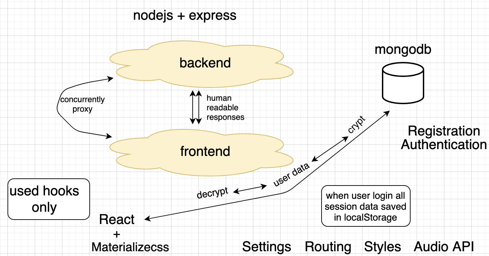
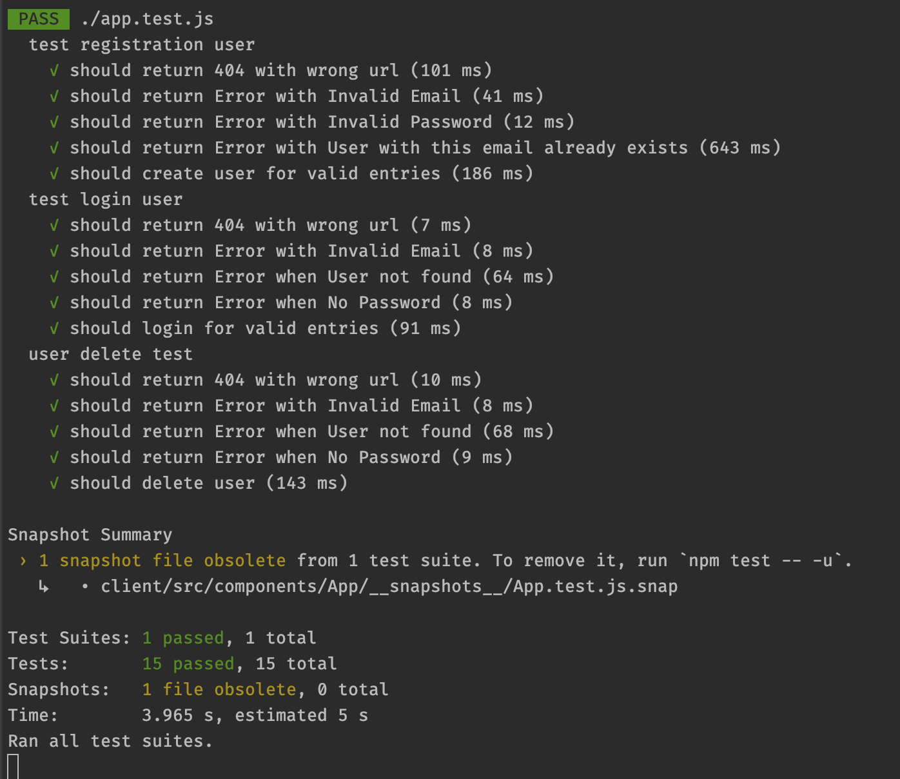
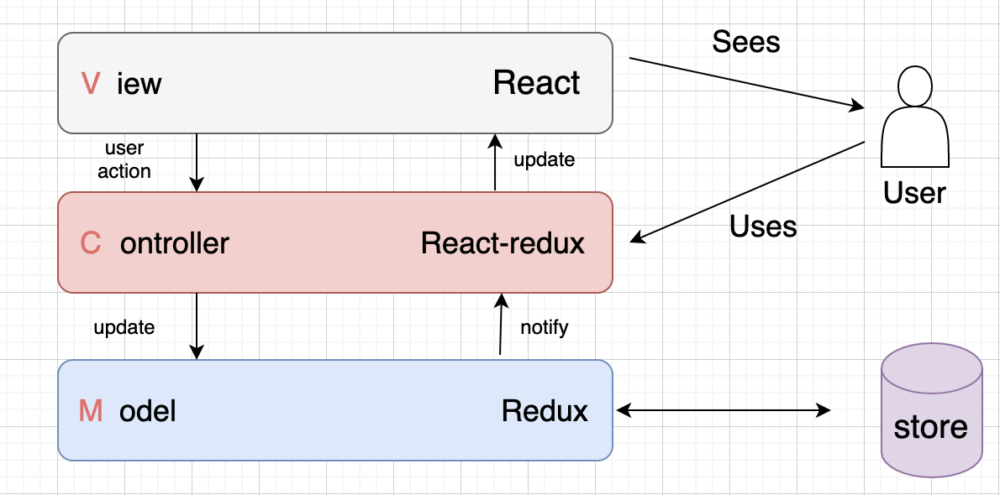
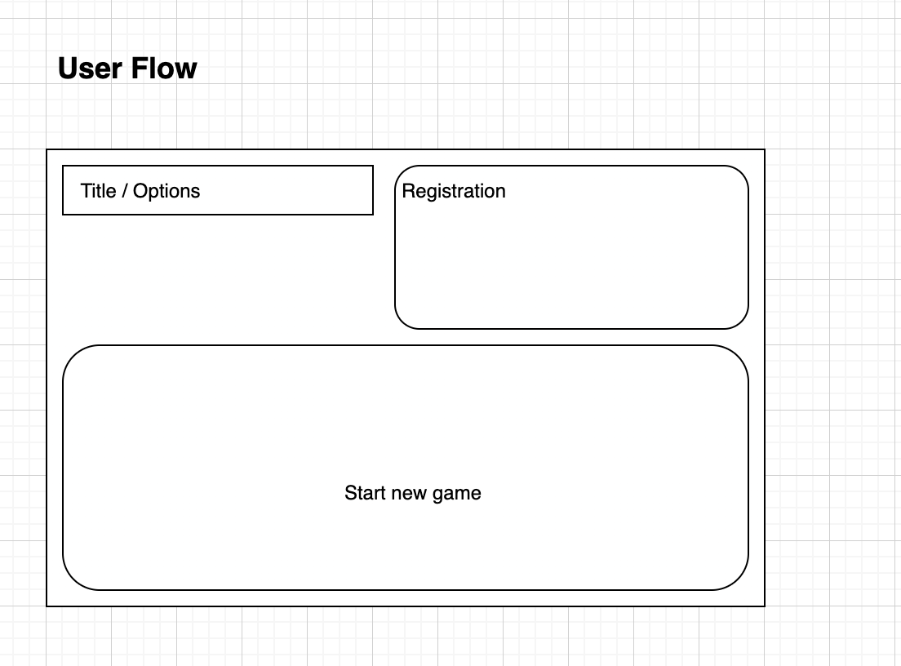

# Google Dinosaur

Useful links: 
[Deployed app](https://protected-garden-00472.herokuapp.com/#!)  
[Dependencies](https://docs.google.com/spreadsheets/d/1EW4S75RduHSZUBiBKbPH_Bdpbufl5vGMeJ3wcevVn-0/edit#gid=0)  
[App architecture](https://app.diagrams.net/#G1NL3jbCWAwSI8U9Nmwk4KDkVEqR8xNAFl)  

### How To Use:

clone or download this repo:

`git clone https://github.com/YuriAnisimov27/RS-Clone.git`

install dependencies:

`cd rsclone` 
`npm i` 
`cd client` 
`npm i` 

### Scripts:

<ul>
<li>npm run server - run server</li>
<li>npm run client - run client</li>
<li>npm run dev - run both</li>
<li>npm run test - run tests</li>
</ul>

## Used dependencies:
### Server
#### Dependencies: 

    "bcryptjs": "^2.4.3",
    "config": "^3.3.3",
    "cookie-parser": "~1.4.4",
    "cors": "^2.8.5",
    "express": "^4.16.4",
    "express-validator": "^6.9.0",
    "jsonwebtoken": "^8.5.1",
    "mongoose": "^5.11.9"

#### DevDependencies: 

    "@babel/plugin-transform-modules-commonjs": "^7.12.1",
    "@typescript-eslint/eslint-plugin": "^4.14.1",
    "@typescript-eslint/parser": "^4.14.1",
    "concurrently": "^5.3.0",
    "eslint": "^7.18.0",
    "eslint-config-airbnb": "^18.2.1",
    "eslint-config-prettier": "^7.2.0",
    "eslint-plugin-html": "^6.1.1",
    "eslint-plugin-import": "^2.22.1",
    "eslint-plugin-jest": "^24.1.3",
    "eslint-plugin-prefer-arrow": "^1.2.2",
    "eslint-plugin-prefer-arrow-functions": "^3.0.1",
    "eslint-plugin-prettier": "^3.3.1",
    "jest": "^26.6.3",
    "nodemon": "^2.0.6",
    "prettier": "^2.2.1",
    "supertest": "^6.0.1"

### Client

#### Dependencies:

    "@testing-library/jest-dom": "^5.11.9",
    "@testing-library/react": "^11.1.0",
    "@testing-library/user-event": "^12.1.10",
    "enzyme": "^3.11.0",
    "enzyme-adapter-react-16": "^1.15.6",
    "materialize-css": "^1.0.0-rc.2",
    "mongoose": "^5.11.11",
    "react": "^17.0.1",
    "react-chrome-dino": "^0.1.3",
    "react-dom": "^17.0.1",
    "react-google-login": "^5.2.2",
    "react-redux": "^7.2.2",
    "react-router-dom": "^5.2.0",
    "react-scripts": "4.0.1",
    "react-test-renderer": "^17.0.1",
    "redux": "^4.0.5",
    "web-vitals": "^0.2.4",
    "phaser": "^3.17.0"

#### DevDependencies:

    "eslint": "^7.18.0",
    "eslint-config-airbnb": "^18.2.1",
    "eslint-config-prettier": "^7.2.0",
    "eslint-plugin-html": "^6.1.1",
    "eslint-plugin-import": "^2.22.1",
    "eslint-plugin-jsx-a11y": "^6.4.1",
    "eslint-plugin-prettier": "^3.3.1",
    "eslint-plugin-react": "^7.22.0",
    "eslint-plugin-react-hooks": "^4.2.0",
    "image-webpack-loader": "^7.0.1",
    "jest": "^26.6.3",
    "prettier": "^2.2.1"

### App Architecture

1. That's how we see our app:

Game is heart of this application, we added beauty using Materializecss, logic by React-Redux and all this inside nodejs-exprees

2. Let's go a little deeper...

 

We used one programming language - JavaScript. There is no problem with this on the client. 
On the server side, nodejs and mongodb also use JS. This way the code interacts perfectly.
The main task of the server part is to process server requests - REST API and store data in a database.

3. Registration

Yes, one of the main and obvious server-client relationships is storing and receiving user data. 
And then we did this:
- we use email as login. And validate it. this introduces some limitations but ensures that the user does not create a 
  login like 1234567 or login or something like that.
- it's easier with a password - one requirement! the length limit is 6 characters. any symbols are allowed.
- after checking the data, we send them to the server, where the password is encrypted and saved to the database. Super! 
  Now such a user exists. now you can log in)
  PS: don't worry if you enter something wrong. The hint will not be long in coming. Wrong login, short password, 
  registration of a user under an email that is already registered and much more is already provided. In addition, 
  the whole process of work from entering data to deleting data from the database is covered by tests. See for yourself:
  
`npm run test`

see next:

Well, of course, registration is not the most interesting thing in the application (although if you want to get to the interesting, 
then registration will still have to go through) inside - an improved version of the game and the ability to customize the application. 
Initially, you have a good old google dinosaur, a player and a choice of language. After registration, you can go deeper into 
customization and all this will not be lost after restarting the application. And of course our tips will come to help you)

4. MVC

This is the most interesting. Technical aspects of implementation. Of course, the coolest thing is a game, but it is 
encapsulated and embedded in the general application system and is nothing more than just a block. Smart interesting 
funny block. But how does it work?

If at this stage I start talking about the technologies, libraries and frameworks that we have used, then I am almost 
100% sure that you will start scrolling down the page with the hope that there might be something interesting there. 
I will not load you with boring dry information that you can easily find on Google. But if you're interested, links and 
descriptions of dependencies are in the attached file above.
I'll do it a little differently. I'll tell you how we did what we did.

### Episode 1. Does anyone have any idea how we can do all this?

We are 4 people in development. but we are not completely strangers. two had previously done one COVID19 project and 
two another. but there the level and complexity of the application was completely different. In general, of course, 
we started with an acquaintance. We told about ourselves about the technologies that we can help the project and how we 
generally imagine what should turn out

We started by adding tasks to JIRA and made a small layout:

The plan was this:
1. There will be a name for the game (which still does not exist)
2. For some reason there will be registration
3. There will be a game
4. We will win

### Episode 2. Details

